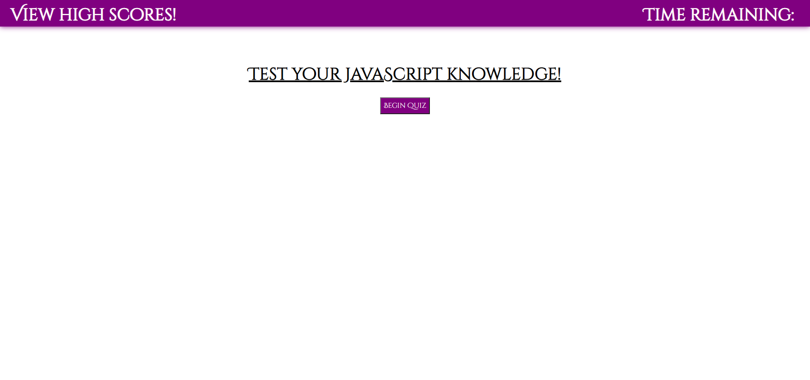

# 04 Web API's Coding Quiz

## Contributers
* Chris Whalen, Github: **[CobaltFrostfish](https://github.com/CobaltFrostfish)**

## Links
* **[Repository](https://github.com/CobaltFrostfish/coding-quiz)**
* **[Live site](https://cobaltfrostfish.github.io/coding-quiz/)**

## The project
This project contains a short quiz to test your coding knowledge of Javascript. This coding quiz was built primarily using Javascript with a base document in HTML and stylig with CSS. Test your knowledge!

## Technologies applied
* HTML
* CSS
* JavaScript

## The final production:
